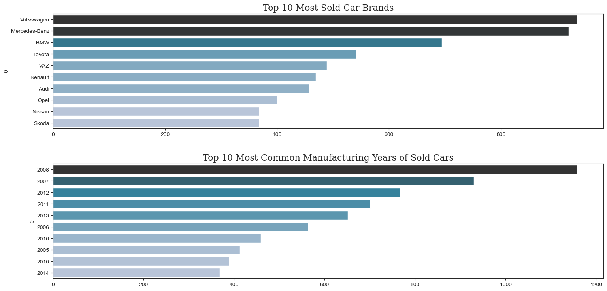
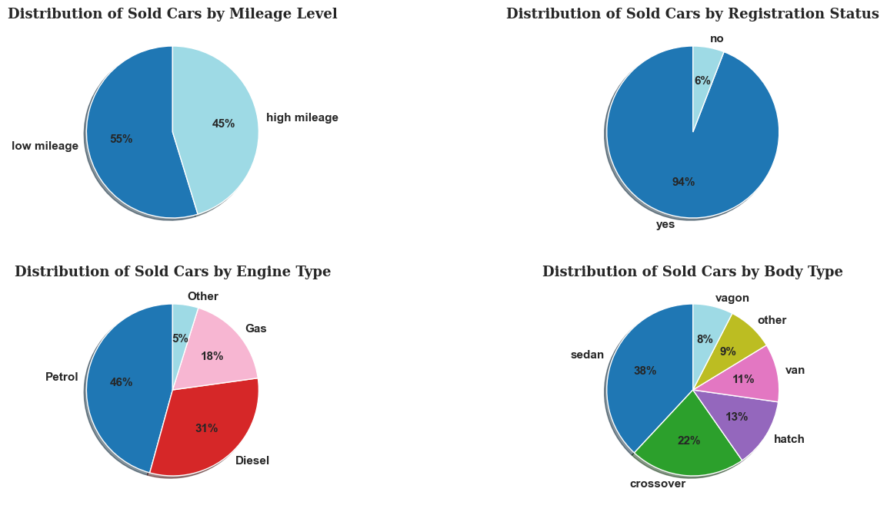
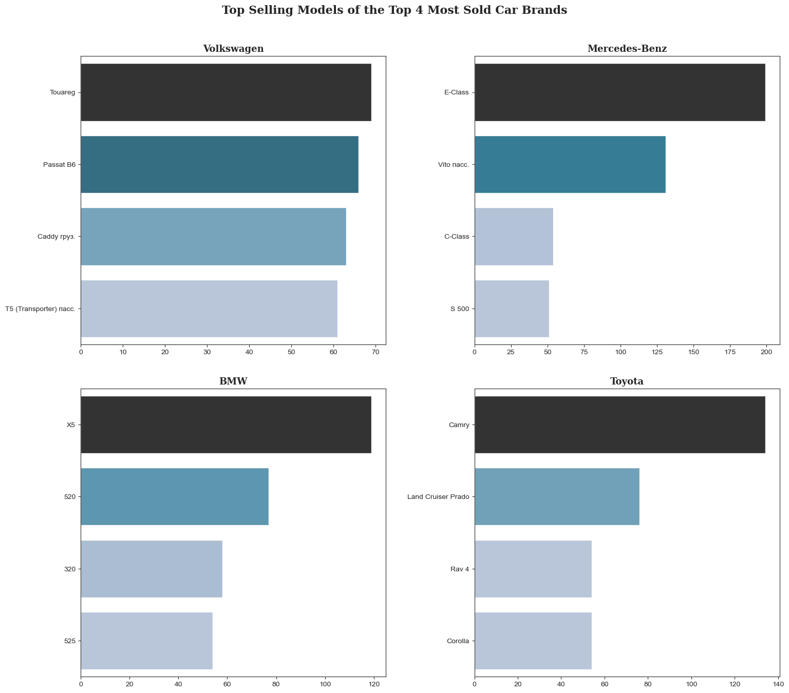
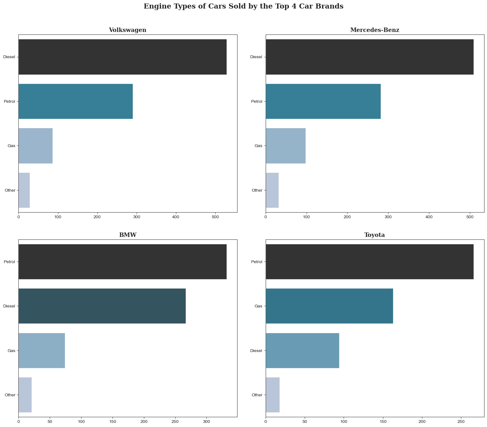
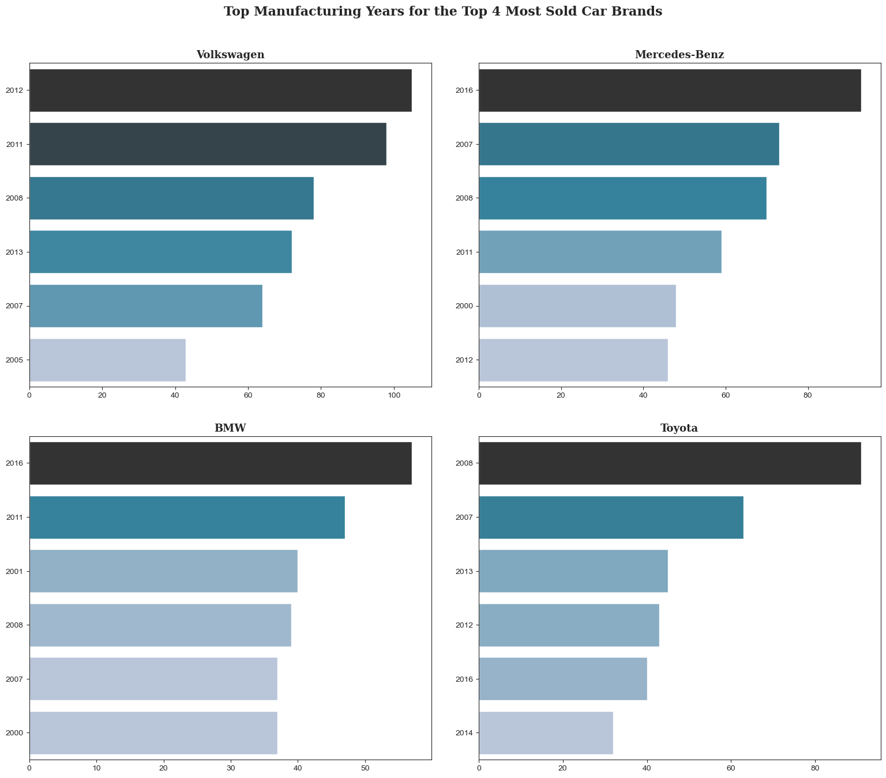
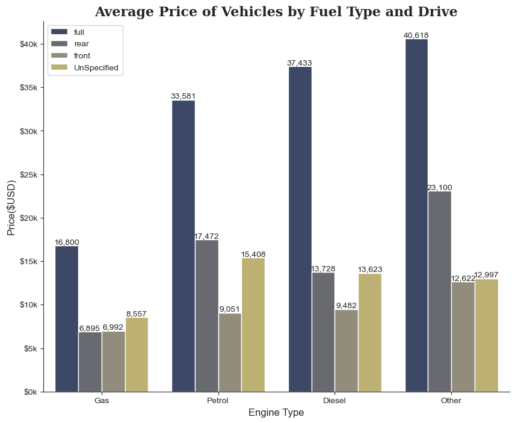
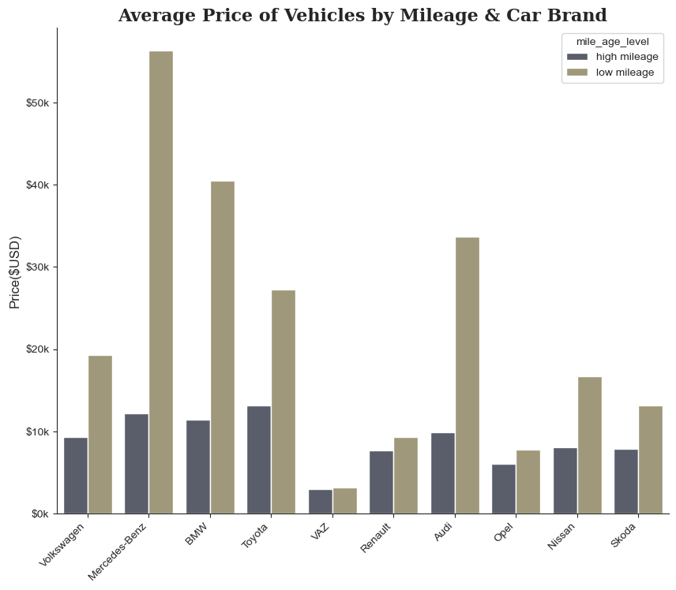
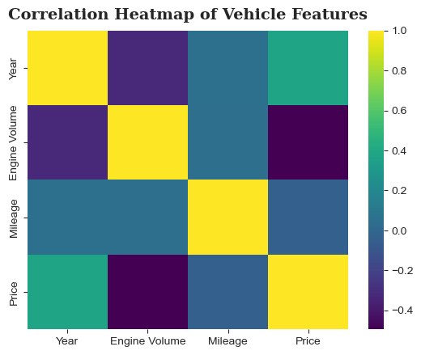

# 🚗 Ukraine used  Car Market — Exploratory Data Analysis

##  Introduction

This project analyzes a dataset of **used cars sold in Ukraine**, sourced from a Ukrainian automotive marketplace. The dataset captures real-world listings and transactions, providing insight into buyer preferences, pricing trends, and vehicle characteristics in the Ukrainian  car market.

### Dataset Overview

The dataset contains **9,576 vehicle listings** with the following columns:

| Column | Description |
|---|---|
| `car` | Car brand (e.g., Volkswagen, BMW, Toyota) |
| `model` | Model name of the vehicle |
| `price` | Price of the vehicle (USD) |
| `year` | Manufacturing year |
| `mileage` | Vehicle mileage |
| `engV` | Engine displacement |
| `engType` | Fuel type (Petrol, Diesel, Gas, Other) |
| `body` | Body type (sedan, crossover, hatchback, etc.) |
| `drive` | Drive type (front, rear, full) |
| `registration` | Whether the car is registered |

---

##  Data Cleaning

After exploring the dataset, the following cleaning steps were applied before analysis:

- **Standardize column names**
  Convert all column names to lowercase to avoid typing mistakes during data processing.

- **Clean the price column**
  Remove extreme or unrealistic values such as `0`, because they do not represent real car values.

- **Handle missing values in engine volume (`engV`)**
  Replace missing values using the **mean engine volume for each car model**.

- **Handle missing values in drive type (`drive`)**
  Replace missing values with `"Unspecified"` since this column is categorical.

---

##  Exploratory Data Analysis (EDA)

### 1. Top 10 Most Sold Car Brands & Manufacturing Years

**Insights:**
- **Volkswagen** and **Mercedes-Benz** dominate the market by a wide margin, each with nearly 1,000 listings.
- **2008** is the single most common manufacturing year, suggesting a large cohort of ~15-year-old vehicles still actively traded.
- Years **2007–2013** collectively represent the bulk of the used car supply, indicating the typical age range buyers seek.

---

### 2. Distribution of Categorical Variables

**Insights:**
- **Mileage:** 55% of sold cars fall in the low-mileage category — buyers show a preference for lower-usage vehicles.
- **Registration:** An overwhelming 94% of sold cars are registered, reflecting buyer preference for legally compliant vehicles.
- **Engine Type:** Petrol leads at 46%, followed by Diesel (31%) and Gas (18%).
- **Body Type:** Sedans are the most popular body style (38%), followed by crossovers (22%) and hatchbacks (13%).

---

### 3. Deep Dive: Top 4 Car Brands

#### 3a. Top Selling Models

**Insights:**
- The **Mercedes-Benz E-Class** (~200 units) is the single best-selling model across all brands.
- **Toyota Camry** (~134 units) leads among Japanese brands, reflecting strong trust in reliability.
- Volkswagen's top sellers are spread across commercial-adjacent models (Touareg, Passat B6, Caddy), showing diverse demand.

#### 3b. Engine Type Distribution

**Insights:**
- **Volkswagen and Mercedes-Benz** are diesel-dominant, consistent with European driving culture and long-distance efficiency needs.
- **BMW** leans petrol-first, followed by diesel — reflecting its performance-oriented lineup.
- **Toyota** shows the strongest Gas (LPG) adoption, likely driven by the cost-conscious conversion market in Ukraine.

#### 3c. Top Manufacturing Years

**Insights:**
- **Volkswagen** listings peak around **2011–2012**, indicating a strong mid-2010s purchase cohort now entering resale.
- **Mercedes-Benz** shows a notable spike for **2016** models, suggesting newer luxury vehicles are actively traded.
- **BMW and Toyota** both show dispersed distributions across 2000–2016, indicating broad multi-generational demand.

---

### 4. Average Price by Fuel Type & Drive

**Insights:**
- **Full-drive (4WD)** vehicles command the highest prices across all fuel types — peaking at **$40,618** for "Other" fuel types.
- Diesel full-drive vehicles average **$37,433**, significantly above front- or rear-drive equivalents.
- **Gas-powered** cars remain the most affordable across all drive types, averaging well below $17k.
- Front-drive and unspecified-drive vehicles cluster in the $7k–$15k range, representing the budget segment.

---

### 5. Average Price by Mileage & Car Brand

**Insights:**
- **Mercedes-Benz** shows the most dramatic mileage-price spread: low-mileage units average **~$56k** vs. ~$12k for high-mileage.
- **BMW** and **Audi** also exhibit large premiums for low-mileage condition, confirming that luxury brands retain value strongly when well-maintained.
- **VAZ** (Lada) remains the most affordable brand regardless of mileage, averaging below $3k in both categories.

---

### 6. Correlation Heatmap

**Insights:**
- **Year ↔ Price**: Moderate positive correlation — newer cars fetch higher prices, as expected.
- **Mileage ↔ Price**: Moderate negative correlation — higher mileage is associated with lower prices.
- **Engine Volume ↔ Year**: Slight negative correlation, possibly reflecting the trend toward smaller, more efficient engines in recent models.
- **Engine Volume ↔ Price**: Slight negative correlation overall, though this may be offset by luxury/performance segment outliers.

---

##  Key Takeaways

1. The Ukrainian used car market is dominated by **European brands** (VW, Mercedes-Benz, BMW), with a strong presence of 2007–2013 vehicles.
2. **Diesel and petrol** are the most common fuel types; gas conversions are notable in budget segments.
3. **Sedans and crossovers** represent the majority of body types.
4. **Drive type and mileage** are among the strongest price differentiators — especially for premium brands.
5. Low-mileage **Mercedes-Benz** units command the highest average prices in the dataset.